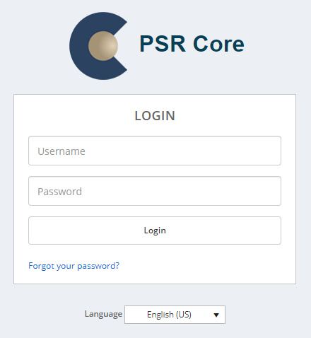
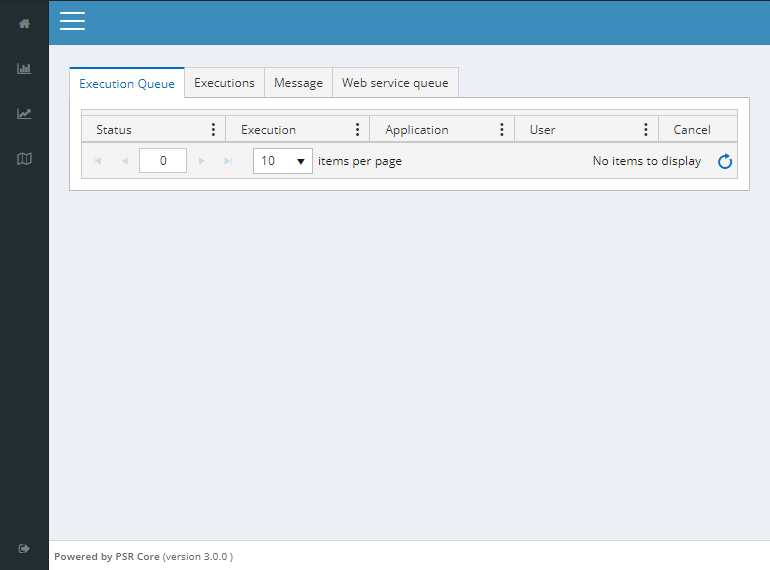

# Getting Started

From any web browser, preferably Google Chrome, you may enter the URL for the PSR Core web application: [PSRCore staging](https://psrcorestaging.psr-inc.com/) (link given as an example)

### Logging in

The system will present a login dialog where the user should inform their access credentials and language of preference.

    

The [Password Recovery](05_Password.html) tab contains more information on how to recover your password.

## The web interface

The image below should give a fair overview of the interface:

    

A few key components can be seen, and are described in more detail below.

### 1. Quick access menu

Used for pages that are frequently accessed. A more in-depth description is given under [Navigation](03_Navigation.html).

### 2. Main menu

Main [navigation](03_Navigation.html) component, to access other application screens.

### 3. Upper bar

Some screens will show a dropdown at the upper bar. This indicates that the screen in question will contain data that is specific to the option selected there, and some attention must be given so that the wrong option is not selected once changes are made.

### 4. Contents

The contents on every page may vary a lot depending on the application. There are, however, some fairly common structures used by multiple perspectives, such as grids. The user is also given many options for configuring the environment, which have widespread consequences on the framework behaviour. These are better discussed into subsequent chapters.
