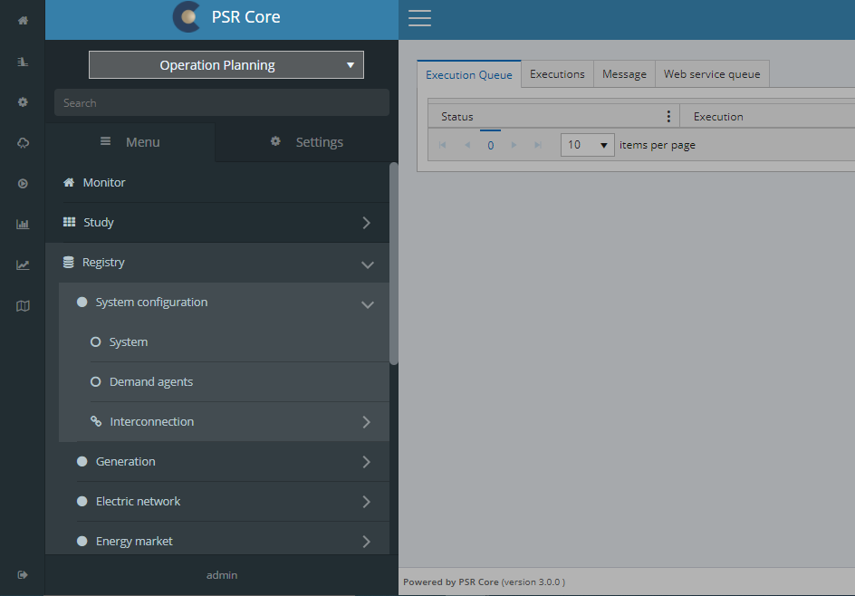

# Navigation

To the left, we have a quick access menu. The main Menu ir right beside it, as can be seen in the image below. The numbers associated to each component describe their basic functionalities.

    

### 1. Home button

Will return the user to the initial screen.

### 2. Main menu

Used to show and retreat the main menu. There is an option to keep the menu fixated under user settings.

### 3. Menu items

The items inside the menu will link the user to the corresponing screen. Some items may instead open a submenu containing nested items, usually to categorize or group functionality.

### 4. Settings tab

Used for menu items that meddle with configurations, such as [user preferences](06_Preferences.html), instead of options that are specific to the application domain.

### 5. User

The username of the currently logged in account.

### 6. Logout

The user can logout by clicking on the lower left button. Notice that the user will remain logged in after closing the web navigator tab.
