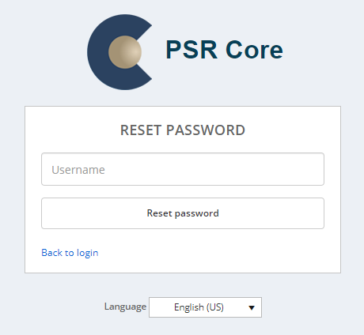

# Password recovery

The user can have their own password reset by clicking "forgot your password?" at the [login](02_GettingStarted.html) page.

    

According to the PSR security policy guidelines, passwords must follow these rules:

•	8 characters minimum;

•	At least one uppercase and lowercase letter;

•	At least one number;

•	At least one special character (that is not a letter or a number).
