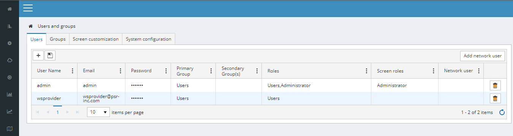

# Access control

PSRCore uses a mechanism based on authentication and authorization. Users must create/own an account, as stated
[here](02_GettingStarted.html). Once the user is logged in, PSRCore filters the information that the user is allowed to access, according to the groups and roles associated to that user.

## Objects

Every element in the database is called an object, and every object is associated to both an owner (user) and an owner group.

## Groups

This multi-user system is similar to how Unix works, where the user must be associated to a primary group, and can also be in multiple secondary groups. The objective of the primary group is to define the permission for objects created by the user: once an object is registered, it belongs to the primary group of that user, so that every other user within the same primary group can view and edit such object.

The secondary group, on the other hand, only allows users to view the objects associated to it.

## Roles

User roles can be defined by the administrator in order to grant (or limit) access to the screens, perspectives and menus available in the system. There are a couple special roles that are worth to mention: the admin and the users roles.

The admin role defines access to every perspective and menu in the application, including the settings menu to configure other users and their groups/roles. It is the only one allowed to include, edit and remove users from the system.

The users role defines base access to the menus and perspectives of the system, except for those that are restricted.

## Managing access

Groups and roles can be set by the administrator at Settings -> Users and Groups. This can be seen in the image below:

    

 
Much like how it's described in [grids](04_Grids.html), press the plus sign to include a user, and inform a username, e-mail and password by editing the corresponding fields. Do not forget to save changes before leaving.
 