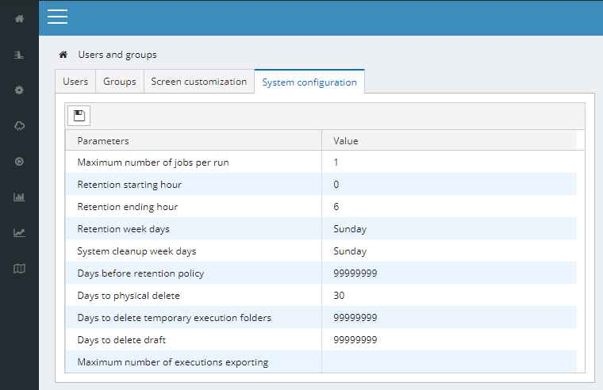

### Application configuration

Along with the previously presented user preferences and other was to configure the interface, the options shown in the image below are made available and will apply to all users. These should be only changed by the administrator.

    

### Integration

PSRCore provides a REST API for communication with external systems. 

### Dependencies

The PSRCore framework utilizes two database systems: [MongoDB](https://www.mongodb.com/) and [Cassandra](https://cassandra.apache.org). Both systems are NoSQL, providing high scalability and flexibility for managing data. The main/common data is stored in MongoDB, using a JSON format, while Cassandra is used for data that is relatively large in volume, such as time series.

Along with those, many parts of the interface are built using [KendoUI](https://www.telerik.com/kendo-ui) components.