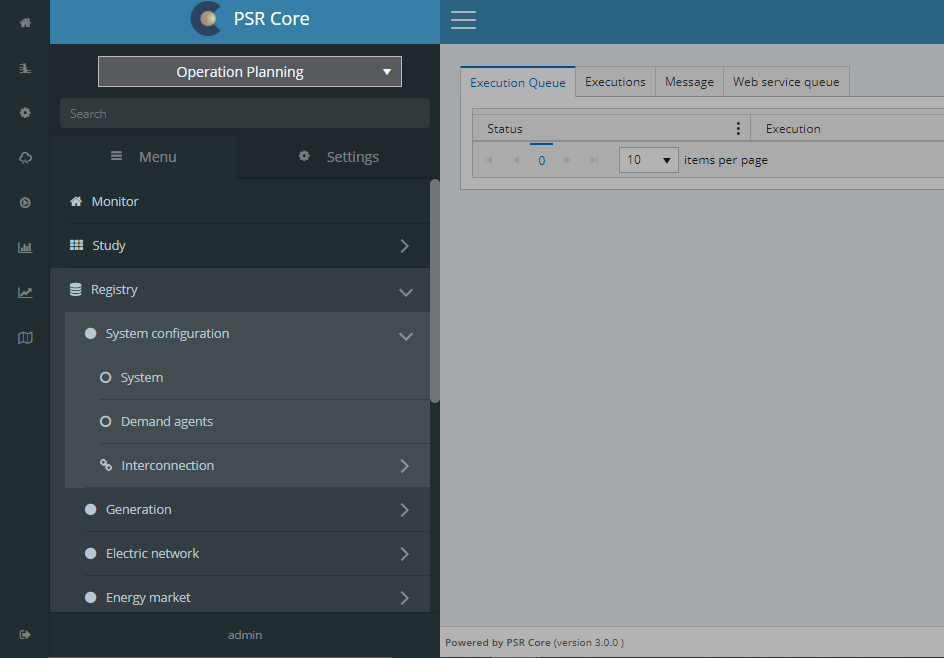

# Navigation

To the left, we have a quick access menu. The main Menu ir right beside it, as can be seen in the image below. The numbers associated to each component describe their basic functionalities.

    

### 1. Home

Will return the user to the initial screen.

### 2. Show/Retreat menu

There is an option to fixate the menu under user settings.

### 3. Menu items

The items inside the menu will link the user to the corresponing screen. Some contain nested items

### 4. Settings tab

### 5. User

### 6. Logout

The user can logout by clicking on the lower left button. Notice that the user will remain logged in after closing the web navigator tab.
